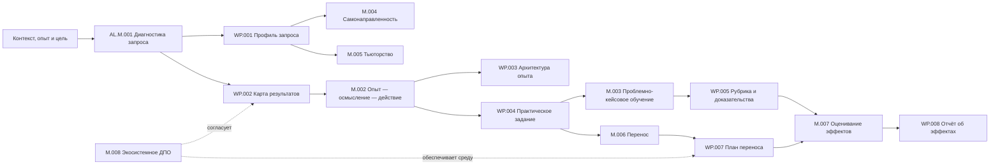

# [AL.MAP.001] Карта домена

## Core flow

## Navigation

| Need | Start | Then |
|---|---|---|
| Понять границы домена | `01A-bounded-context.md` | `ontology.md` |
| Не путать ключевые понятия | `01B-distinctions.md` | `05-failure-modes/failure-modes.md` |
| Спроектировать обратную связь | AL.D.006, AL.SOTA.009 | AL.M.002, AL.WP.004, AL.WP.005 |
| Различить эффект ИИ и освоение | AL.D.011 | AL.SOTA.006, AL.WP.005, AL.WP.008 |
| Спроектировать основу программы | AL.M.001 → AL.WP.001/002 | AL.M.002 → AL.WP.003/004 |
| Добавить индивидуальную траекторию | AL.M.004, AL.M.005 | AL.WP.006 |
| Обеспечить рабочее применение | AL.M.006, AL.SOTA.008 | AL.WP.007, AL.WP.008 |
| Оценить эффект | AL.M.007 | AL.WP.005, AL.WP.008 |
| Построить партнёрскую ДПО | AL.M.008 | роли AL.R.004–R.007 |
| Проверить силу утверждения | `06-sota/source-register.md` | revision criterion сущности |

## Quality gates

1. **Request gate:** WP.001 содержит действие, контекст и авторство цели.
2. **Alignment gate:** результат, практика и доказательство трассируются друг к другу.
3. **Adult-learning gate:** опыт и готовность к самостоятельности реально диагностированы.
4. **Safety gate:** проблематизация, обратная связь и сбор данных имеют границы и право отказа; комментарий о личности не подменяет данные о задаче, процессе и саморегуляции.
5. **Transfer gate:** среда применения и ответственность сторон подтверждены, а вывод о переносе опирается не только на самоотчёт и учитывает тип рабочего действия.
6. **Evidence gate:** сила вывода не превышает качество данных.
7. **AI-support gate:** режим доступа к ИИ зафиксирован, а поддержанная результативность не выдаётся за освоенную способность.

## Update log

| Date | Change |
|---|---|
| 2026-08-17 | Integrated AL.SOTA.009 into feedback navigation and safety gate |
| 2026-08-17 | Integrated AL.SOTA.008 into transfer navigation and evidence gate |
| 2026-08-16 | Added navigation and quality gate for AL.D.011; linked AL.SOTA.006 to evidence products |

