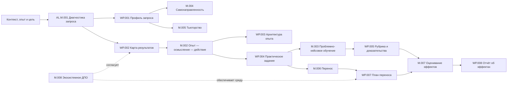

# [AL.MAP.001] Карта домена

## Core flow

## Navigation

| Need | Start | Then |
|---|---|---|
| Понять границы домена | `01A-bounded-context.md` | `ontology.md` |
| Не путать ключевые понятия | `01B-distinctions.md` | `05-failure-modes/failure-modes.md` |
| Спроектировать обратную связь | AL.P.003 (`pilot`) | AL.D.006, AL.SOTA.009, AL.M.002, AL.WP.004, AL.WP.005 |
| Спроектировать воспроизведение по памяти | AL.P.004 (`pilot`) | AL.D.004, AL.D.006, AL.SOTA.010, AL.M.002, AL.M.003, AL.WP.003–005 |
| Управлять когнитивными требованиями и поддержкой | AL.P.005 (`pilot`) | AL.D.004, AL.D.011, AL.SOTA.011, AL.M.002–004, AL.WP.003, AL.WP.004, AL.WP.006 |
| Перевести от примера к самостоятельному действию | AL.P.005 (`pilot`) | AL.D.004, AL.D.011, AL.SOTA.012, AL.M.002, AL.M.004, AL.WP.003, AL.WP.004, AL.WP.006 |
| Спроектировать продуктивный запрос помощи | AL.P.002 (`pilot`) | AL.OA.007, AL.D.006, AL.SOTA.013–014, AL.M.002, AL.M.004, AL.M.005, AL.WP.003, AL.WP.006 |
| Обеспечить безопасный вопрос, предупреждение и эскалацию | AL.OA.007, AL.SOTA.014 | AL.M.004, AL.M.005, AL.WP.006, AL.FM.008 |
| Учиться на ошибке и справедливо распределять ответственность | AL.P.006 (`pilot`) | AL.D.012, AL.SOTA.015, AL.M.002, AL.M.004, AL.WP.005, AL.WP.006, AL.FM.005, AL.FM.008 |
| Доказать научение из ошибки или инцидента | AL.P.001 (`pilot`) | AL.D.007, AL.SOTA.016, AL.M.006, AL.M.007, AL.WP.005, AL.WP.007, AL.WP.008, AL.FM.006, AL.FM.007 |
| Различить эффект ИИ и освоение | AL.D.011 | AL.SOTA.006, AL.WP.005, AL.WP.008 |
| Проверить запрос и выбрать тип решения | AL.P.009 (`pilot`) | AL.D.003, AL.SOTA.017, AL.M.001 → AL.WP.001; при подтверждённой образовательной части → AL.WP.002 |
| Выбрать и пересматривать индивидуальную траекторию | AL.P.010 (`pilot`) | AL.D.009, AL.M.004, AL.M.005, AL.SOTA.018 → AL.WP.006 |
| Обеспечить рабочее применение | AL.P.007 (`pilot`) | AL.M.006, AL.SOTA.008, AL.WP.007, AL.WP.008 |
| Оценить эффект | AL.P.008 (`pilot`) | AL.M.007, AL.WP.005, AL.WP.008 |
| Построить партнёрскую ДПО | AL.M.008 | роли AL.R.004–R.007 |
| Проверить силу утверждения | `06-sota/source-register.md` | revision criterion сущности |

## Quality gates

1. **Request gate:** WP.001 содержит действие, контекст и авторство цели.
2. **Alignment gate:** результат, практика и доказательство трассируются друг к другу.
3. **Adult-learning gate:** опыт и готовность к самостоятельности реально диагностированы.
4. **Safety gate:** проблематизация, обратная связь и сбор данных имеют границы и право отказа; комментарий о личности не подменяет данные о задаче, процессе и саморегуляции.
5. **Transfer gate:** среда применения и ответственность сторон подтверждены, а вывод о переносе опирается не только на самоотчёт и учитывает тип рабочего действия.
6. **Evidence gate:** сила вывода не превышает качество данных.
7. **AI-support gate:** режим доступа к ИИ зафиксирован, а поддержанная результативность не выдаётся за освоенную способность.
8. **Retention gate:** если требуется долговременное сохранение знания, архитектура включает воспроизведение без доступа к образцу, коррекцию ошибки и новую попытку; перенос в рабочую практику проверяется отдельно.
9. **Cognitive-demands gate:** существенная сложность, лишние требования, реалистичность и временная поддержка различены; самостоятельная способность не выводится только из выполнения с подсказкой.
10. **Support-transfer gate:** помощь соответствует конкретному выполнению, допускает снятие и возврат, а передача ответственности подтверждается самостоятельной контрольной пробой.
11. **Help-seeking gate:** для затруднения заданы доступные источники, минимально достаточные уровни помощи и условия немедленной эскалации; после помощи участник перерабатывает ответ и выполняет новую пробу, а качество не выводится из числа вопросов.
12. **Psychological-safety gate:** реальная реакция на вопрос, ошибку и предупреждение не унижает добросовестного участника; для угрозы заданы адресат с полномочиями, срок подтверждения, следующий уровень и возврат результата, а предметные стандарты и ответственность сохранены.
13. **Error-learning gate:** действие, исход, нарушение и вывод об ответственности различены; защищённая учебная ошибка ведёт к коррекции и новой пробе, а рабочее событие — к сохранению данных, проверяемому изменению и объяснимому решению по объявленной процедуре.
14. **Incident-learning evidence gate:** сообщение, вывод, изменение, внедрение, соблюдение, результат, устойчивость и перенос измеряются раздельно; число сообщений и закрытых мероприятий не подменяют операционный эффект, а показатели учитывают экспозицию и ограничения интерпретации.
15. **Request-diagnosis gate:** тема и разрыв выполнения не выданы за образовательную потребность; целевое действие установлено, а способность, возможность и мотивация проверены по достаточным данным.
16. **Adaptive-trajectory gate:** назван изменяемый компонент, данные, правило, ожидаемый результат и контрольная точка; активность сопровождения и ИИ-рекомендация не выданы за результат.

## Update log

| Date | Change |
|---|---|
| 2026-08-20 | Added AL.P.010 as the entry for choosing and revising an individual educational trajectory |
| 2026-08-18 | Integrated AL.SOTA.016 into incident-learning measurement, implementation evidence, sustainability and transfer |
| 2026-08-19 | Integrated AL.SOTA.017 into request diagnosis, solution selection and evidence products |
| 2026-08-19 | Integrated AL.SOTA.018 into adaptive trajectory, tutoring, work-product and failure-mode guidance |
| 2026-08-18 | Integrated AL.SOTA.012 into example-to-action transition, adaptive support and AI target modes |
| 2026-08-18 | Integrated AL.SOTA.013 into self-regulation, tutoring, help-source selection, escalation and AI-help modes |
| 2026-08-18 | Integrated AL.SOTA.014 into psychological safety, response to questions, safety voice and closed-loop escalation |
| 2026-08-18 | Integrated AL.SOTA.015 into error distinctions, protected practice, incident learning and fair accountability |
| 2026-08-18 | Integrated AL.SOTA.011 into learning-cycle, case, adaptive-support and cognitive-demands navigation |
| 2026-08-18 | Integrated AL.SOTA.010 into learning-cycle, task, evidence and retention navigation |
| 2026-08-17 | Integrated AL.SOTA.009 into feedback navigation and safety gate |
| 2026-08-17 | Integrated AL.SOTA.008 into transfer navigation and evidence gate |
| 2026-08-16 | Added navigation and quality gate for AL.D.011; linked AL.SOTA.006 to evidence products |

