# [AL.MAP.001] Карта домена

## Core flow

```mermaid
flowchart LR
    A["Исходный запрос и контекст системы"] --> M10["AL.M.010 Выбор маршрута"]
    M10 --> W10["WP.010 Основание и маршрут"]
    W10 -->|образовательная часть подтверждена| M1["AL.M.001 Диагностика запроса"]
    W10 -->|способность человека для будущей работы| HCD["HCD.1 / HCD.3"]
    HCD -->|квалифицированный объект + нужен adult-learning| M1
    W10 -->|хронический разрыв результативности| ATB["Pack-АТБ"]
    ATB -->|образовательная часть системного решения| M1
    M1 --> D14["D.014 Субъект результата × отношение к основаниям"]
    D14 --> W1["WP.001 Профиль запроса"]
    D14 --> W2["WP.002 Карта результатов"]
    W1 --> M4["M.004 Самонаправленность"]
    W1 --> M5["M.005 Тьюторство"]
    W2 --> M2["M.002 Опыт — осмысление — действие"]
    M2 --> W3["WP.003 Архитектура опыта"]
    M2 --> W4["WP.004 Практическое задание"]
    W4 --> M3["M.003 Проблемно-кейсовое обучение"]
    M3 --> W5["WP.005 Критериальная шкала и доказательства"]
    W4 --> M6["M.006 Перенос"]
    M6 --> W7["WP.007 План переноса"]
    W7 -. свидетельства переноса .-> HCD
    W5 --> M7["M.007 Оценивание эффектов"]
    W7 --> M7
    M7 --> W8["WP.008 Отчёт об эффектах"]
    W5 -. данные выполнения .-> HCD
    M8["M.008 Экосистемное ДПО"] -. согласует .-> W2
    M8 -. обеспечивает среду .-> W7
    W2 --> M9["M.009 Развивающий переход"]
    M2 -. конфликт и данные .-> TOC9["Pack-TOC: полная туча и ограничивающее предположение"]
    TOC9 -. проверенное основание .-> M9
    M9 --> W9["WP.009 Карта развивающего перехода"]
    W9 --> M6
    W9 --> M7
```

## Navigation

| Need | Start | Then |
|---|---|---|
| Понять границы домена | `01A-bounded-context.md` | `ontology.md` |
| Не путать ключевые понятия | `01B-distinctions.md` | `05-failure-modes/failure-modes.md` |
| Спроектировать обратную связь | AL.P.003 (`pilot`) | AL.D.006, AL.SOTA.009, AL.M.002, AL.WP.004, AL.WP.005 |
| Спроектировать воспроизведение по памяти | AL.P.004 (`pilot`) | AL.D.004, AL.D.006, AL.SOTA.010, AL.M.002, AL.M.003, AL.WP.003–005 |
| Управлять когнитивными требованиями и поддержкой | AL.P.005 (`pilot`) | AL.D.004, AL.D.011, AL.SOTA.011, AL.M.002–004, AL.WP.003, AL.WP.004, AL.WP.006 |
| Перевести от примера к самостоятельному действию | AL.P.005 (`pilot`) | AL.D.004, AL.D.011, AL.SOTA.012, AL.M.002, AL.M.004, AL.WP.003, AL.WP.004, AL.WP.006 |
| Спроектировать продуктивный запрос помощи | AL.P.002 (`pilot`) | AL.OA.007, AL.D.006, AL.SOTA.013–014, AL.M.002, AL.M.004, AL.M.005, AL.WP.003, AL.WP.006 |
| Обеспечить безопасный вопрос, предупреждение и эскалацию | AL.P.015 (`pilot`) | AL.SOTA.014, AL.OA.007, AL.R.003–005, AL.M.004–005, AL.WP.006, AL.FM.008 |
| Учиться на ошибке и справедливо распределять ответственность | AL.P.006 (`pilot`) | AL.D.012, AL.SOTA.015, AL.M.002, AL.M.004, AL.WP.005, AL.WP.006, AL.FM.005, AL.FM.008 |
| Доказать научение из ошибки или инцидента | AL.P.001 (`pilot`) | AL.D.007, AL.SOTA.016, AL.M.006, AL.M.007, AL.WP.005, AL.WP.007, AL.WP.008, AL.FM.006, AL.FM.007 |
| Проверить освоенную способность при использовании ИИ | AL.P.016 (`pilot`) | AL.SOTA.023, AL.D.011, AL.R.001–003, AL.R.005, AL.R.007, AL.WP.002, AL.WP.004–005, AL.WP.008 |
| Проверить основание запроса и выбрать системный маршрут | AL.P.018 (`pilot`) | AL.SOTA.025, AL.M.010 → AL.WP.010 → Pack-АТБ, другой системный домен, прямая проверка или остановка |
| Определить требуемую способность человека, диагностировать ограничение и решить, нужен ли специализированный метод обучения взрослых | HCD.1, HCD.3 | `human capability-demand account` + `qualified intervention target` либо `non-training return` → при необходимости adult-learning в AL.P.009 |
| Проверить образовательную часть и выбрать тип решения | AL.P.009 (`pilot`) | после AL.WP.010: AL.D.003, AL.SOTA.017, AL.M.001 → AL.WP.001; при подтверждённой образовательной части → AL.WP.002 |
| Выбрать вид научения по субъекту результата и отношению к основаниям | AL.D.014 | отдельный взрослый или коллектив × действие в пределах оснований или с их пересмотром → раздельные результаты, методы и доказательства в AL.WP.001–002; для развития → AL.M.009 и AL.WP.009 |
| Согласовать результат, практическое задание и доказательство освоения | AL.P.011 (`pilot`) | AL.SOTA.019, AL.WP.002–005, AL.M.002, AL.M.003, AL.M.007 |
| Спроектировать учебный кейс, проблему или симуляцию | AL.P.014 (`pilot`) | AL.SOTA.022, AL.M.003, AL.R.002–003, AL.R.005 → AL.WP.003–005 |
| Преобразовать профессиональный опыт в проверяемое новое действие | AL.P.012 (`pilot`) | AL.SOTA.020, AL.OA.002, AL.OA.006, AL.M.002 → AL.WP.003 |
| Выявить конфликт и ограничивающее убеждение для развивающего перехода | Pack-TOC `TOC.M.003`, `TOC.M.004`, `TOC.M.009`, `TOC.D.006` | проверить обе стороны конфликта и передать результат в AL.P.017 → AL.WP.009 |
| Выбрать и пересматривать индивидуальную траекторию | AL.P.010 (`pilot`) | AL.D.009, AL.M.004, AL.M.005, AL.SOTA.018 → AL.WP.006 |
| Сравнить полные программы, профиль способностей и общий индивидуальный маршрут | HCD.2, HCD.4, HCD.14, HCD.15 | HCD принимает специализированные adult-learning механизмы, но сохраняет решение о программе и её пересмотре |
| Обеспечить рабочее применение | AL.P.007 (`pilot`) | AL.M.006, AL.SOTA.008, AL.WP.007, AL.WP.008 |
| Оценить эффект | AL.P.008 (`pilot`) | AL.M.007, AL.WP.005, AL.WP.008 |
| Построить партнёрскую ДПО | AL.P.013 (`pilot`) | AL.SOTA.021, AL.M.008, AL.R.001–002, AL.R.004–007 → AL.WP.002, AL.WP.007, AL.WP.008 |
| Спроектировать развивающий переход | AL.P.017 (`pilot`) | AL.SOTA.024, AL.D.013, AL.M.009, AL.R.001–003, AL.R.005–007 → AL.WP.009 → AL.WP.003–005, AL.WP.007–008 |
| Проверить новое основание в реальной совместной работе до масштабирования | AL.P.019 (`pilot`) | AL.SOTA.024, Pack-TOC, AL.P.017, AL.M.009 → AL.WP.009 → AL.P.003, AL.P.007–008 |
| Освоить действие на новом основании в обычной рабочей среде | AL.P.020 (`pilot`) | AL.SOTA.024, STH.DEV.069, AL.P.017, AL.M.009 → AL.WP.009 → AL.P.003, AL.P.005, AL.P.007–008; при блокировке среды → AL.P.019 |
| Построить ещё неизвестное решение совместно с группой практиков | AL.P.021 (`pilot`) | AL.SOTA.024, STH.DEV.042, STH.DEV.058–060, AL.M.002 → AL.WP.003, AL.WP.007–009 → AL.P.003, AL.P.007–008, AL.P.012–013, AL.P.015, AL.P.017, AL.P.019–020 |
| Встроить научение в уже принадлежащее группе организационное изменение | AL.P.022 (`pilot`) | AL.SOTA.024, STH.DEV.045, STH.DEV.062, AL.M.002, AL.M.009 → AL.WP.003, AL.WP.007–009 → AL.P.003, AL.P.007–008, AL.P.012, AL.P.015, AL.P.017–021 |
| Проверить, не создаёт ли повторяющееся «личное» затруднение сама система | AL.P.023 (`pilot`) | AL.SOTA.024, STH.DEV.045, STH.DEV.061, AL.P.018, AL.M.010 → AL.WP.010 → AL.P.009, AL.P.012, AL.P.015, AL.P.017, AL.P.021–022, Pack-АТБ, Pack-TOC |
| Связать основание конкретного человека с поддерживающими условиями организации и выбрать предмет изменения | AL.P.024 (`pilot`) | AL.SOTA.024, STH.DEV.045, STH.DEV.063–064, AL.P.018, AL.M.009 → AL.WP.009 → AL.P.009, AL.P.012, AL.P.017, AL.P.019–020, AL.P.023, Pack-АТБ, Pack-TOC |
| Организовать научение группы внутри обоснованной и полномочной трансформации | AL.P.022 (`pilot`) | Pack-АТБ или другой предметный домен → AL.P.018 → AL.SOTA.026, AL.M.009 → AL.WP.009 → AL.P.020, AL.P.007–008; AL.P.025 отозван как междоменный дубль |
| Провести полную Лабораторию изменений по архитектуре Энгестрёма | AL.P.026 (`candidate/bounded`) | AL.SOTA.026 → предварительное исследование → зеркальные данные → двойная стимуляция → семь учебных действий → реальные пробы → закрепление; предметное решение из Pack-АТБ, Pack-TOC или другого домена |
| Провести ОДИ для открытой коллективной проблемы без предзаданного способа решения | AL.P.027 (`candidate/bounded`) | AL.P.018 → AL.SOTA.027 → предварительная диагностика → собственный организационный проект → программа-гипотеза → позиции и функции команды → проблематизация, схематизация, рефлексия и самоопределение → раздельные результаты → послеигровой переход; при хроническом разрыве сначала Pack-АТБ, AL.P.026 остаётся отдельной альтернативой |
| Проверить основание, статус и границы утверждения | `06-sota/source-register.md` | профиль оснований, допустимое использование и критерий пересмотра |
| Вернуть индивидуальные доказательства выполнения, переноса, сохранения и зависимости от ИИ | AL.P.007, AL.P.011, AL.P.016 → HCD.11–13 | HCD квалифицирует итоговый capability-claim; Pack сохраняет только образовательный механизм и наблюдения |
| Квалифицировать производство нового знания внутри учебной работы | AL.P.008, AL.P.018–021 → RMP.1–4 | RMP возвращает остановку либо исследовательский вопрос, дизайн, исполнимый протокол и проверяемый след; Pack сохраняет учебный механизм, а HCD и OCE — свои результаты |

## Quality gates

1. **Routing gate:** WP.010 фиксирует происхождение запроса, границу рассматриваемой системы, первое лицо, мандат, тип ситуации и маршрут; хронический разрыв результативности не подменяется локальной диагностикой обучения.
2. **Request gate:** WP.001 содержит действие, контекст и авторство цели, принятые из зафиксированного маршрута.
3. **Alignment gate:** результат, практика и доказательство связаны моделями способности, доказательства и задания; уровень действия, выборка задач, режим поддержки, индивидуальность вывода и последствия решения названы.
4. **Adult-learning gate:** опыт и готовность к самостоятельности реально диагностированы.
5. **Safety gate:** проблематизация, обратная связь и сбор данных имеют границы и право отказа; комментарий о личности не подменяет данные о задаче, процессе и саморегуляции.
6. **Transfer gate:** среда применения и ответственность сторон подтверждены, а вывод о переносе опирается не только на самоотчёт и учитывает тип рабочего действия.
7. **Evidence gate:** сила вывода не превышает качество данных.
8. **AI-support gate:** названы объект вывода, целевой режим и существенные действия человека; результат сеанса, способность человека и способность системы «человек + ИИ» не смешаны; контроль проверен на полезной и существенно ошибочной рекомендации; происхождение опирается на совокупность свидетельств; изменение, сбой и граница конфигурации соответствуют широте вывода; поддержанное выполнение, освоение и эффект программы разделены.
9. **Retention gate:** если требуется долговременное сохранение знания, архитектура включает воспроизведение без доступа к образцу, коррекцию ошибки и новую попытку; перенос в рабочую практику проверяется отдельно.
10. **Cognitive-demands gate:** существенная сложность, лишние требования, реалистичность и временная поддержка различены; самостоятельная способность не выводится только из выполнения с подсказкой.
11. **Support-transfer gate:** помощь соответствует конкретному выполнению, допускает снятие и возврат, а передача ответственности подтверждается самостоятельной контрольной пробой.
12. **Help-seeking gate:** для затруднения заданы доступные источники, минимально достаточные уровни помощи и условия немедленной эскалации; после помощи участник перерабатывает ответ и выполняет новую пробу, а качество не выводится из числа вопросов.
13. **Psychological-safety gate:** реальная реакция на вопрос, ошибку и предупреждение не унижает добросовестного участника; для угрозы заданы адресат с полномочиями, срок подтверждения, следующий уровень и возврат результата, а предметные стандарты и ответственность сохранены.
    Регистрация не считается закрытием; режим канала и предел идентифицируемости объявлены; при конфликте доступен независимый адресат; число сообщений не заменяет данные реакции и результата; цифровой или ИИ-вход подтверждает передачу человеку с полномочиями.
14. **Error-learning gate:** действие, исход, нарушение и вывод об ответственности различены; защищённая учебная ошибка ведёт к коррекции и новой пробе, а рабочее событие — к сохранению данных, проверяемому изменению и объяснимому решению по объявленной процедуре.
15. **Incident-learning evidence gate:** сообщение, вывод, изменение, внедрение, соблюдение, результат, устойчивость и перенос измеряются раздельно; число сообщений и закрытых мероприятий не подменяют операционный эффект, а показатели учитывают экспозицию и ограничения интерпретации.
16. **Request-diagnosis gate:** тема и разрыв выполнения не выданы за образовательную потребность; целевое действие установлено; отдельно названы субъект результата и необходимость пересмотра оснований; несколько клеток `AL.D.014` имеют раздельные результаты и доказательства; способность, возможность и мотивация проверены по достаточным данным.
17. **Adaptive-trajectory gate:** назван изменяемый компонент, данные, правило, ожидаемый результат и контрольная точка; активность сопровождения и ИИ-рекомендация не выданы за результат.
18. **Experience-transformation gate:** след события отделён от позднего объяснения; стаж не выдан за экспертизу; есть проверяемая альтернатива и изменённая проба; функции раскрытия, читатели, последствия и предел конфиденциальности известны.
19. **Partner-configuration gate:** каждый партнёр закрывает необходимый переход; результаты сторон, локальные обязательства, рабочий объект, критерий приёмки, полномочия, данные и сценарий отказа названы; процесс сети не выдан за результат взрослого, а ИИ не назначен владельцем решения.
20. **Problem-case gate:** вид конструкции назван по действию и реакции среды; существенные признаки меняют решение; информационный режим и поддержка функциональны; совместный продукт имеет индивидуальный след; разбор ведёт к новой пробе; выборка, симуляция и ИИ имеют явные границы вывода.
21. **Development gate:** освоение, совершенствование и развитие различены, выбрана минимально достаточная глубина; содержание, способ решения и предпосылки не смешаны; противоречие не создаётся искусственным потрясением; проверяемый диалог допускает данные, возражения и альтернативы; новое объяснение доведено до плана, способности, безопасной пробы и повтора; названы авторство, мандат, поддержка и препятствия среды, «Я — Мы — Это», жизнеспособность и раздельные непосредственный, отсроченный и организационный результаты. Если основание связано с устойчивым конфликтом, обе стороны проверены средствами Pack-TOC без предположения о заранее неправом исполнителе; гипотеза открыта для исправления.
22. **Field-school gate:** проверенное решение испытывается на ограниченном реальном объекте во временно разрешённой системе ролей и правил; выполнены повторные циклы с данными; самостоятельность, перенос и эффект всей системы проверяются отдельно от группового согласия и локального результата.
23. **Action-research gate:** принятие новой перспективы не выдано за способность; опорная модель конкретна и пересматриваема; участник сохраняет существенные решения; реальные циклы меняются по данным; поддержка снимается; препятствия основания, модели, способности и среды разделены.
24. **Collaborative-inquiry gate:** вопрос действительно принадлежит группе и не имеет назначенного ответа; полномочия и должностная власть видимы; конкурирующие объяснения проверяются повторными рабочими циклами; отрицательные случаи и особые мнения сохраняются; предварительное знание ограничено проверенными условиями; индивидуальное научение, групповая практика и системный эффект разведены.
25. **Reflective-participation gate:** устойчивая группа действительно владеет ведущимся изменением; участие не скрывает чужого решения или риска санкций; цель и локальный интерес проверены относительно целой системы; завершённый эпизод ведёт к отличающемуся следующему действию; преподаватель не присваивает управление; индивидуальное научение, совместная способность, ход изменения и системный эффект разведены.
26. **Collective-clarification gate:** несколько сопоставимых эпизодов людей в сходном положении отделены от оценок; первый круг защищён от прямой санкционной зависимости; повторяющиеся условия сопоставлены с исключениями; личные и системные объяснения сохранены; отношения власти не назначены причиной заранее; гипотеза ограничена и передана владельцу или в предметный домен.
27. **Personal-social-integration gate:** конкретный эпизод связан с личным основанием, его прежней полезностью и необходимой функцией; организационное условие проверено отдельно; человек и система не назначены причиной заранее; выбран предмет изменения; новое действие и изменение условия согласованы по владельцам, мандату, риску и раздельным результатам.
28. **Learning-within-transformation gate:** происхождение, решение и организационная часть преобразования получены из Pack-АТБ, OCE или другого компетентного домена; заданное отделено от решений группы; наблюдаемые данные отделены от диагноза консультанта; есть мандат, безопасное возражение, рабочая проба и повтор; индивидуальное освоение, совместная способность, практика, устойчивость и системный эффект имеют отдельные свидетельства.
29. **Change-Laboratory gate:** полная лаборатория включает предварительное исследование, представительную группу, защищённые зеркальные данные, системный и исторический анализ, создаваемое участниками средство двойной стимуляции, порождающую модель, семь различимых учебных действий, полномочные реальные пробы, повторы, план закрепления и отсроченное наблюдение; короткий семинар или готовая модель обозначены только как фрагмент.
30. **OAG gate:** ОДИ применяется к проблеме без заранее известного способа решения после проверки более простых форматов; заказ, тема, ситуация и проблема различены; есть диагностика, собственный организационный проект, представительные позиции, способная команда, открытые цели и власть, изменяемая программа со следом решений, безопасная проблематизация, оспариваемые схемы, самоопределение, пять раздельных результатов и послеигровой переход при обещании внешнего эффекта.
31. **HCD handoff gate:** для индивидуального развития названы человек,
    представительная будущая работа, требуемый вклад, квалифицированный объект
    развития, текущая конфигурация выполнения и условия участия; Pack выбирает
    и описывает специализированный механизм обучения взрослых, а общий выбор
    программы и выводы о способности, переносе, сохранении и зависимости от
    поддержки возвращаются в HCD.
32. **RMP handoff gate:** учебный вопрос, рабочая проба, рефлексия и локальная
    гипотеза не выданы за исследование; при обещании нового знания отдельно
    получены применимые результаты RMP.1–4, а намерения протокола отделены от
    фактического следа. Анализ, достоверность, синтез знания, освоение человека
    и изменение организации не выводятся из одного исследовательского журнала.

## Update log

| Date | Change |
|---|---|
| 2026-09-09 | Added AL.D.014 and routed diagnosis through two independent axes: individual versus collective outcome and action within current grounds versus their revision |
| 2026-09-08 | Built and internally boundary-tested AL.P.027 «Организационно-деятельностная игра» as candidate/bounded; kept it outside the selected 24-pattern edition pending real application |
| 2026-09-08 | Integrated accepted AL.SOTA.027 claims into existing roles and work products without new entities; OAG-specific team functions and products remain local to future AL.P.027 |
| 2026-09-08 | Confirmed working saturation of AL.SOTA.027 after owner review: six pattern layers and boundary situations are covered by STH.ODI.CLAIM.001–034; four evidence deficits remain and constrain AL.P.027 to candidate/bounded |
| 2026-09-08 | Accepted refined STH.ODI.CLAIM.034 as bounded: the corpus supports a testable OAG pattern candidate, without claims of comparative superiority, guaranteed effect or safety, or reproducibility from description alone; all 34 claims are now reviewed |
| 2026-09-08 | Accepted refined STH.ODI.CLAIM.033 as current practice: OAG classification follows reconstructed method architecture rather than self-label, without treating simpler formats as inferior |
| 2026-09-08 | Accepted refined STH.ODI.CLAIM.032 as bounded: reproducibility and safety depend on the whole team's evidenced capabilities, while no validated universal qualification standard was found |
| 2026-09-08 | Accepted refined STH.ODI.CLAIM.031 as current practice: emotional intensity and induced pressure are not evidence of development; outcomes and adverse effects are checked independently |
| 2026-09-08 | Accepted refined STH.ODI.CLAIM.030 as current practice: known goals, power limits, data use, participation conditions and challenge routes are disclosed to OAG participants |
| 2026-09-08 | Accepted refined STH.ODI.CLAIM.029 as bounded: transfer from the temporary OAG system requires a separately designed external transition, whose sufficient architecture is not established by OAG studies |
| 2026-09-08 | Accepted refined STH.ODI.CLAIM.028 as current practice and defined activity grounds as a cross-domain Pack synthesis checked through reasoned, self-directed and repeated later action |
| 2026-09-08 | Accepted refined STH.ODI.CLAIM.027 as current practice: an OAG product remains a change hypothesis until owned, tried and checked in the external activity system |
| 2026-09-08 | Accepted refined STH.ODI.CLAIM.026 as current practice: client outcome and participant development may diverge, so priorities and independent evidence are agreed before the OAG |
| 2026-09-08 | Accepted refined STH.ODI.CLAIM.025 as current practice: subject, organizational, learning, research and external results require separate claims and evidence |
| 2026-09-08 | Accepted refined STH.ODI.CLAIM.024 as current practice: facilitator influence and content contributions remain explicit, and a fixed answer is not presented as participant co-design |
| 2026-09-08 | Accepted refined STH.ODI.CLAIM.023 as bounded: OAG work processes recur through explicit triggers and products rather than following one universal sequence or arbitrary improvisation |
| 2026-09-08 | Accepted refined STH.ODI.CLAIM.022 as bounded: self-positioning links a participant to an owned position and action but does not create external authority or prove follow-through |
| 2026-09-07 | WP-68: extended the RMP handoff through RMP.3 operationalization and RMP.4 criticism-ready trace; retained all adult-learning patterns |
| 2026-09-07 | Accepted refined STH.ODI.CLAIM.021 as current practice: a scheme is a contestable means of joint thinking and choosing action, not decoration or methodologist-given truth |
| 2026-09-07 | Accepted refined STH.ODI.CLAIM.020 as current practice: reflection reconstructs observable work and informs what to change or retain; changed grounds require later action evidence |
| 2026-09-07 | Accepted refined STH.ODI.CLAIM.019 as bounded: problematizing an established professional way requires material from participants' real activity; case reasoning does not prove workplace transformation |
| 2026-09-07 | Accepted refined STH.ODI.CLAIM.018 as current practice: problematization is evidenced by exposing an inadequate way and reframing the problem, not by emotional intensity or devaluing a participant |
| 2026-09-07 | Accepted renamed STH.ODI.CLAIM.017 as bounded: organizing-team functions remain explicit even when historically variable roles or one person combine them |
| 2026-09-07 | Accepted refined STH.ODI.CLAIM.016 as bounded: OAG may model future activity while organizing real in-game thought-activity, without treating this as external transfer |
| 2026-09-07 | Accepted renamed STH.ODI.CLAIM.015 as current practice: groups, plenaries and reflection are characteristic forms whose presence does not define OAG without functional continuity |
| 2026-09-07 | Accepted refined STH.ODI.CLAIM.014 as current practice: the OAG program is a controlled, traceably revised hypothesis about process rather than a script for participant answers |
| 2026-09-07 | Accepted refined STH.ODI.CLAIM.013 as bounded: each classical OAG has a situation-specific organizational design while method invariants remain explicit and reproducible |
| 2026-09-07 | Accepted refined STH.ODI.CLAIM.012 as current practice: full OAG effort includes preparation, delivery and exit work without imposing a universal preparation ratio |
| 2026-09-07 | Accepted refined STH.ODI.CLAIM.011 as current practice: substantive preparation and diagnosis are part of classical OAG, while preparation must not predetermine the content result |
| 2026-09-07 | Accepted refined STH.ODI.CLAIM.010 as current practice: participant composition seeks essential positions, names absences and bounds proxy representation without freezing positions in the game |
| 2026-09-07 | Accepted refined STH.ODI.CLAIM.009 as current practice: system boundaries are explicit, versioned and revisable without unbounded expansion |
| 2026-09-07 | Accepted STH.ODI.CLAIM.008 as current practice: order, theme, initial situation and problem-in-game are distinct and every change of framing must remain traceable and authorized |
| 2026-09-07 | Accepted refined STH.ODI.CLAIM.007 as current practice: the organizer may hold hypotheses and control the process but must not present a predetermined content answer as an open collective result |
| 2026-09-07 | Accepted refined STH.ODI.CLAIM.006 as bounded: classical OAG starts from a problem not reducible in advance to a known task; simpler formats remain the default when the solution method is already known |
| 2026-09-07 | Accepted refined STH.ODI.CLAIM.005 as current practice and synchronized all current summaries: individual, collective-work and external-activity changes are separate results |
| 2026-09-07 | Accepted refined STH.ODI.CLAIM.004 as bounded: OAG deliberately organizes transitions among thought-action, communication, reflection and schematization without treating the format as proof that collective thought-activity occurred |
| 2026-09-06 | Reframed STH.ODI.CLAIM.003 close to the SMD source and accepted it as bounded; Pack implications remain separate |
| 2026-09-06 | Accepted refined STH.ODI.CLAIM.002 as current practice; separated the SMD source claim from the Pack verification rule |
| 2026-09-06 | Accepted STH.ODI.CLAIM.001 as a bounded design stance; claims 002–034 remain under owner review |
| 2026-09-06 | Refined STH.ODI.CLAIM.001 as a bounded design stance and added scientific comparison with joint and distributed cognition |
| 2026-09-06 | Formulated STH.ODI.CLAIM.001–034 without a preset cap; sequential owner review is pending |
| 2026-09-06 | Registered 28-source corpus and 12-stream coverage for AL.SOTA.027; claim formulation is now pending |
| 2026-09-06 | Opened AL.SOTA.027 on organizational-activity games and thought-activity; AL.P.027 remains an unadmitted target candidate |
| 2026-09-05 | Built AL.P.026 «Лаборатория изменений» as a candidate/bounded named method while preserving the withdrawal of generic duplicate AL.P.025 |
| 2026-09-05 | WP-58: added the HCD ↔ PACK-adult-learning routing contract and separated specialized adult-learning methods from the general individual capability-development lifecycle |
| 2026-09-05 | Withdrew AL.P.025 as a cross-domain duplicate of Pack-ATB; integrated the educational residue of AL.SOTA.026 into AL.P.018, AL.P.017, AL.P.020, AL.P.022, AL.M.009 and AL.WP.009 |
| 2026-09-04 | Opened AL.SOTA.026 and added navigation to the 23-source corpus on expansive learning and Change Laboratory |
| 2026-09-04 | Added AL.P.024 for linking a person's basis with organizational conditions and choosing a coordinated object of change |
| 2026-09-04 | Added AL.P.023 for testing whether repeated individual difficulties are reproduced by shared organizational conditions and power relations |
| 2026-09-04 | Added AL.P.022 for learning inside a real change already owned by a stable group, with explicit protection against pseudo-participation |
| 2026-09-04 | Added AL.P.021 for jointly owned cycles that build provisional contextual knowledge when no reliable solution is ready |
| 2026-08-31 | Added AL.P.020 for repeated real-work action research with a provisional practice model and fading support |
| 2026-08-31 | Added AL.P.019 «Полевые школы» as a bounded temporary activity-system pattern and separated it from seminars, simulations and ordinary pilots |
| 2026-08-29 | Reopened AL.SOTA.024 to harvest reproducible transformative-learning methods while preserving each chapter author's attribution |
| 2026-08-29 | Integrated STH.DEV.CLAIM.031–043 into the development route and related feedback, transfer, evidence, partnership, case and safety patterns; no new entities required |
| 2026-08-29 | Reopened AL.SOTA.024 with eight primary works by Mezirow and 13 proposed claims on levels of change, discourse, reflection, support, provisional roles and reintegration; pattern integration awaits owner review |
| 2026-08-29 | Superseded the duplicate AL.P.019 candidate; routed conflict and limiting-assumption work directly through Pack-TOC and retained its unique safeguards in active patterns |
| 2026-08-29 | Built and boundary-tested AL.P.019 as a candidate before deciding domain ownership |
| 2026-08-29 | Expanded AL.SOTA.024 with the explicit 1974–1996 Argyris and Schön source line |
| 2026-08-29 | Added navigation to the multi-channel evidence profile, adoption status and revision criterion |
| 2026-08-27 | Added AL.P.018, AL.M.010 and AL.WP.010 as the cross-Pack request router before AL.P.009; chronic performance gaps route through Pack-ATB |
| 2026-08-24 | Added AL.P.017 as the entry for designing a developmental transition |
| 2026-08-24 | Integrated AL.SOTA.024; added navigation for AL.D.013, AL.M.009, AL.WP.009 and the development gate |
| 2026-08-23 | Added navigation for full `AL.P.016` and included it in the sixteen-pattern pilot edition |
| 2026-08-23 | Integrated `STH.AIC.CLAIM.001–010`: expanded AI-supported capability distinction, roles, evidence products, failure modes and AI-support gate; no new roles or work products required |
| 2026-08-23 | Added AL.P.015 as the entry for safe questions, warning and closed-loop escalation |
| 2026-08-23 | Integrated reopened AL.SOTA.014 supplements into escalation guidance and added AL.P.015 candidate navigation |
| 2026-08-23 | Added AL.P.014 as the entry for problem-, case- and simulation-based learning design |
| 2026-08-23 | Integrated accepted AL.SOTA.022 claims and working definitions into problem/case method, roles, work products, distinctions, failure modes and DPF guidance |
| 2026-08-23 | Added AL.P.013 as the entry for ecosystem design of partner continuing professional education |
| 2026-08-23 | Integrated accepted AL.SOTA.021 claims into ecosystem method, roles, work products, distinctions, failure modes and DPF guidance |
| 2026-08-23 | Added AL.P.012 as the entry for transforming adult experience into verifiable new action |
| 2026-08-23 | Integrated AL.SOTA.020 into experience, reflection, learning-cycle, work-product, distinction and failure-mode guidance |
| 2026-08-23 | Added AL.P.011 as the entry for alignment of learning outcomes, practical tasks and evidence of learning |
| 2026-08-20 | Opened and integrated AL.SOTA.019 for alignment of outcomes, practical tasks and evidence of learning |
| 2026-08-20 | Added AL.P.010 as the entry for choosing and revising an individual educational trajectory |
| 2026-08-18 | Integrated AL.SOTA.016 into incident-learning measurement, implementation evidence, sustainability and transfer |
| 2026-08-19 | Integrated AL.SOTA.017 into request diagnosis, solution selection and evidence products |
| 2026-08-19 | Integrated AL.SOTA.018 into adaptive trajectory, tutoring, work-product and failure-mode guidance |
| 2026-08-18 | Integrated AL.SOTA.012 into example-to-action transition, adaptive support and AI target modes |
| 2026-08-18 | Integrated AL.SOTA.013 into self-regulation, tutoring, help-source selection, escalation and AI-help modes |
| 2026-08-18 | Integrated AL.SOTA.014 into psychological safety, response to questions, safety voice and closed-loop escalation |
| 2026-08-18 | Integrated AL.SOTA.015 into error distinctions, protected practice, incident learning and fair accountability |
| 2026-08-18 | Integrated AL.SOTA.011 into learning-cycle, case, adaptive-support and cognitive-demands navigation |
| 2026-08-18 | Integrated AL.SOTA.010 into learning-cycle, task, evidence and retention navigation |
| 2026-08-17 | Integrated AL.SOTA.009 into feedback navigation and safety gate |
| 2026-08-17 | Integrated AL.SOTA.008 into transfer navigation and evidence gate |
| 2026-08-16 | Added navigation and quality gate for AL.D.011; linked AL.SOTA.006 to evidence products |

